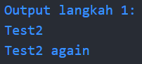
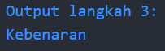
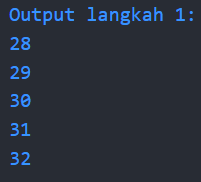
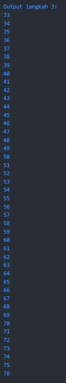
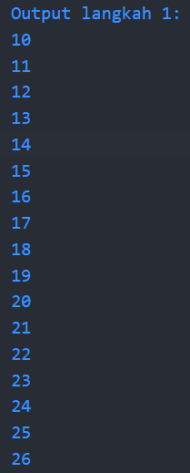
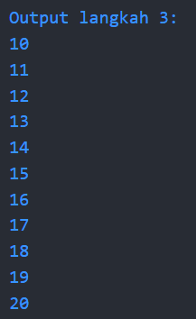
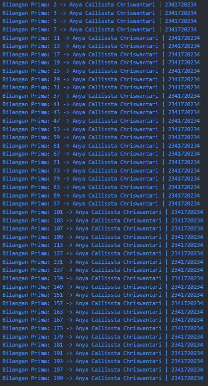

Nama : Anya Callissta Chriswantari
<br>NIM : 2341720234
<br>Kelas : TI 3G
<br>Absen : 05

---

# PEMROGRAMAN MOBILE - PERTEMUAN 3

## Praktikum 1
### Langkah 2
Silakan coba eksekusi (Run) kode pada langkah 1 tersebut. Apa yang terjadi? Jelaskan!
> Jawab:



_Gambar 1. Ouput P1 Langkah 1_
<br>Pada langkah tersebut terjadi output berupa Test2 yang merupakan hasil dari kondisi 

```dart 
else if (test == "test2") {
    print("Test2");
  } 
``` 
dan output kedua berupa Test2 again yang merupakan hasil dari 
```dart  
if (test == "test2") print("Test2 again"); 
```

### Langkah 3
Eksekusi kode pada langkah 3. Apa yang terjadi ? Jika terjadi error, silakan perbaiki namun tetap menggunakan if/else.
> Jawab: Terjadi error karena adanya duplikasi nama variabel test yang sudah digunakan pada langkah sebelumnya. Kemudian dilakukan perbaikan dengan mengganti nama variabel menjadi "test2" dan dihasilkan output seperti gambar di bawah.



_Gambar 2. Ouput P1 Langkah 3_

## Praktikum 2
### Langkah 2
Silakan coba eksekusi (Run) kode pada langkah 1 tersebut. Apa yang terjadi? Jelaskan! Lalu perbaiki jika terjadi error.
> Jawab: Terjadi error karena belum dilakukan deklarasi dan inisialisasi variabel. Setelah variabel dideklarasikan dan diberi nilai 28, didapatkan output seperti gambar di bawah ini.



_Gambar 3. Ouput P2 Langkah 1_

### Langkah 3
Eksekusi kode pada langkah 3. Apa yang terjadi ? Jika terjadi error, silakan perbaiki namun tetap menggunakan do-while.
> Jawab: Didapatkan output berupa angka 33 (lanjutan dari langkah 1) hingga 76 (batas kondisi perulangan < 77>).



_Gambar 4. Ouput P2 Langkah 3_

## Praktikum 3
### Langkah 2
Silakan coba eksekusi (Run) kode pada langkah 1 tersebut. Apa yang terjadi? Jelaskan! Lalu perbaiki jika terjadi error.
> Jawab: Terjadi error karena belum dilakukan deklarasi variabel, setelah dilakukan deklarasi didapatkan output seperti di bawah ini.



_Gambar 5. Ouput P3 Langkah 1_

### Langkah 3
Eksekusi kode pada langkah 3. Apa yang terjadi ? Jika terjadi error, silakan perbaiki namun tetap menggunakan for dan break-continue.
> Jawab: Tidak didapatkan output apapun karena menggunakan operator ||, setelah diubah menjadi && didapatkan output seperti di bawah ini.



_Gambar 6. Ouput P3 Langkah 3_

## Tugas
Buatlah sebuah program yang dapat menampilkan bilangan prima dari angka 0 sampai 201 menggunakan Dart. Ketika bilangan prima ditemukan, maka tampilkan nama lengkap dan NIM Anda.



_Gambar 7. Ouput Tugas_