Nama : Anya Callissta Chriswantari
<br>NIM : 2341720234
<br>Kelas : TI 3G
<br>Absen : 05

---

# PEMROGRAMAN MOBILE - PERTEMUAN 4

## Praktikum 1 - Eksperimen Tipe Data List
### Langkah 2
Silakan coba eksekusi (Run) kode pada langkah 1 tersebut. Apa yang terjadi? Jelaskan!
> Jawab: Program menampilkan output berupa 3 list angka. Angka baris pertama (3) merupakan hasil eksekusi dari panjang list awal, baris kedua (2) merupakan hasil eksekusi dari index ke-1 pada list, dan baris terakhir (1) merupakan hasil eksekusi dari index ke-1 setelah dilakukan perubahan nilai index ke-1 yang tadinya angka 2 menjadi angka 1.

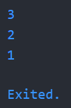

_Gambar 1. Ouput P1 Langkah 1_

### Langkah 3
Ubah kode pada langkah 1 menjadi variabel final yang mempunyai index = 5 dengan default value = null. Isilah nama dan NIM Anda pada elemen index ke-1 dan ke-2. Lalu print dan capture hasilnya.
> Jawab:

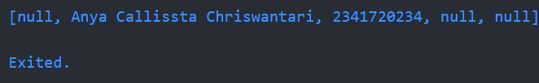

_Gambar 2. Ouput P1 Langkah 3_

## Praktikum 2 - Eksperimen Tipe Data Set
### Langkah 2
Silakan coba eksekusi (Run) kode pada langkah 1 tersebut. Apa yang terjadi? Jelaskan! Lalu perbaiki jika terjadi error.
> Jawab: Program menampilkan output list yang ada pada variabel halogens.

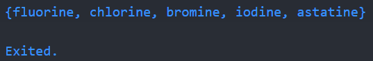

_Gambar 3. Ouput P2 Langkah 1_

### Langkah 3
Eksekusi kode pada langkah 3. Apa yang terjadi ? Jika terjadi error, silakan perbaiki namun tetap menggunakan ketiga variabel tersebut. Tambahkan elemen nama dan NIM Anda pada kedua variabel Set tersebut dengan dua fungsi berbeda yaitu .add() dan .addAll(). Untuk variabel Map dihapus, nanti kita coba di praktikum selanjutnya.
> Jawab: Program menampilkan output berupa {} sebanyak 3 kali. Setelah dilakukan perubahan kode didapatkan output seperti gambar di bawah ini.

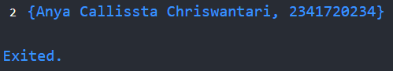

_Gambar 4. Ouput P2 Langkah 3_

## Praktikum 3 - Eksperimen Tipe Data Maps
### Langkah 2
Silakan coba eksekusi (Run) kode pada langkah 1 tersebut. Apa yang terjadi? Jelaskan! Lalu perbaiki jika terjadi error.
> Jawab: Program menampilkan key dan value yang ada pada tiap variabel map gifts dan nobleGases.

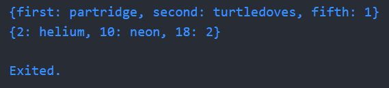

_Gambar 5. Ouput P3 Langkah 1_

### Langkah 3
Eksekusi kode pada langkah 3. Apa yang terjadi ? Jika terjadi error, silakan perbaiki. Tambahkan elemen nama dan NIM Anda pada tiap variabel di atas (gifts, nobleGases, mhs1, dan mhs2). Dokumentasikan hasilnya dan buat laporannya!
> Jawab: Tidak terjadi apapun karena variabel mhs1 dan mhs2 hanya ditambahkan namun tidak dieksekusi dan tidak terjadi duplikasi variabel juga. Setelah dilakukan perubahan kode, didapatkan ouput seperti gambar di bawah ini.

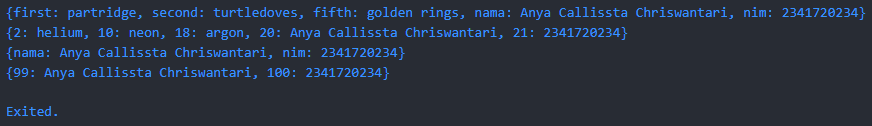

_Gambar 6. Ouput P3 Langkah 3_

## Praktikum 4 - Eksperimen Tipe Data List: Spread dan Control-flow Operators
### Langkah 2
Silakan coba eksekusi (Run) kode pada langkah 1 tersebut. Apa yang terjadi? Jelaskan! Lalu perbaiki jika terjadi error.
> Jawab: Terjadi error karena terdapat kesalahan penulisan variabel pada print, setelah diperbaiki ditampilkan output seperti di bawah ini. Output tersebut merupakan isi dari variabel list, list2, dan panjang list dari list2.

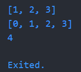

_Gambar 7. Ouput P4 Langkah 1_

### Langkah 3
Eksekusi kode pada langkah 3. Apa yang terjadi ? Jika terjadi error, silakan perbaiki. Tambahkan elemen nama dan NIM Anda pada tiap variabel di atas (gifts, nobleGases, mhs1, dan mhs2). Dokumentasikan hasilnya dan buat laporannya!
> Jawab: Terjadi error karena list1 belum dideklarasikan, setelah dilakukan perbaikan kode didapatkan output seperti gambar di bawah ini. Kode program menampilkan isi dari variabel list1 dan juga panjang list dari variabel list3.

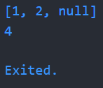

_Gambar 8. Ouput P4 Langkah 3_

### Langkah 4
Eksekusi kode pada langkah 4. Apa yang terjadi ? Jika terjadi error, silakan perbaiki. Tunjukkan hasilnya jika variabel promoActive ketika true dan false.
> Jawab: Terjadi error karena promoActive belum dideklarasikan. Setelah dilakukan perbaikan kode dan promoActive diberi nilai true, program menampilkan output semua isi dari variabel nav2 termasuk value 'Outlet'.

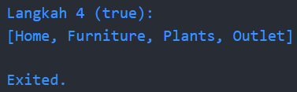

_Gambar 9. Ouput P4 Langkah 4 (true)_

> Jika promoActive bernilai false, program menampilkan isi variabel nav kecuali value 'Outlet'. Hal ini terjadi karena if yang disebut collection if ini berfungsi menambahkan elemen ke dalam list hanya jika kondisi bernilai true.

.png)

_Gambar 10. Ouput P4 Langkah 4 (false)_

### Langkah 5
Eksekusi kode pada langkah 5. Apa yang terjadi ? Jika terjadi error, silakan perbaiki. Tunjukkan hasilnya jika variabel promoActive ketika true dan false.
> Jawab: Terjadi error karena login belum dideklarasikan. Setelah dilakukan perbaikan kode dan login diberi nilai 'Manager', program menampilkan output semua isi dari variabel nav2 termasuk value 'Inventory'.

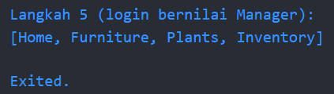

_Gambar 11. Ouput P4 Langkah 5 (login bernilai Manager)_

> Jika login bernilai selain 'Manager', program menampilkan isi variabel nav2 kecuali value 'Inventory'. Hal ini terjadi karena if (... case ...) yang disebut pattern case ini berfungsi mengeksekusi kode setelahnya jika expr yang diuji sesuai dengan pattern yang ditentukan.

.png)

_Gambar 12. Ouput P4 Langkah 5 (login bernilai non Manager)_

### Langkah 6
Eksekusi kode pada langkah 6. Apa yang terjadi ? Jika terjadi error, silakan perbaiki.  Jelaskan manfaat Collection For dan dokumentasikan hasilnya.
> Jawab: Program menampilkan isi variabel listOfString. Collection For digunakan untuk membuat list dari list lain dengan ringkas dan deklaratif secara langsung di dalam list tersebut tanpa perlu menggunakan for loop terpisah.


_Gambar 13. Ouput P4 Langkah 6_

## Praktikum 5 - Eksperimen Tipe Data Records
### Langkah 2
Silakan coba eksekusi (Run) kode pada langkah 1 tersebut. Apa yang terjadi? Jelaskan! Lalu perbaiki jika terjadi error.
> Jawab: 

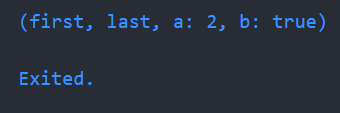

_Gambar 7. Ouput P5 Langkah 1_

### Langkah 3
Eksekusi kode pada langkah 3. Apa yang terjadi ? Jika terjadi error, silakan perbaiki. Gunakan fungsi tukar() di dalam main() sehingga tampak jelas proses pertukaran value field di dalam Records.
> Jawab: Terjadi pertukaran posisi antara variabel 1 dan 2.

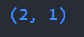

_Gambar 8. Ouput P5 Langkah 3_

### Langkah 4
Eksekusi kode pada langkah 4. Apa yang terjadi ? Jika terjadi error, silakan perbaiki. Inisialisasi field nama dan NIM Anda pada variabel record mahasiswa di atas. Dokumentasikan hasilnya dan buat laporannya!
> Jawab: 

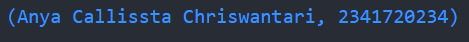

_Gambar 9. Ouput P5 Langkah 4_

### Langkah 5
Eksekusi kode pada langkah 5. Apa yang terjadi ? Jika terjadi error, silakan perbaiki. Gantilah salah satu isi record dengan nama dan NIM Anda, lalu dokumentasikan hasilnya dan buat laporannya!
> Jawab: 

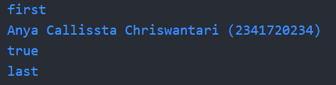

_Gambar 11. Ouput P5 Langkah 5_

## Tugas
2. Jelaskan yang dimaksud Functions dalam bahasa Dart!
> Jawab: Functions (fungsi) adalah blok kode yang dapat digunakan kembali untuk menjalankan tugas tertentu. Function digunakan untuk menghindari pengulangan kode, membuat program lebih terstruktur dan lebih mudah dibaca.
3. Jelaskan jenis-jenis parameter di Functions beserta contoh sintaksnya!
> Jawab: 
* Required Parameter (wajib diisi)
```dart
void tambah(int a, int b) {
  print(a + b);
}
```
* Optional Positional Parameter (opsional, pakai [])
```dart
void cetakInfo(String nama, [int? umur]) {
  print("Nama: $nama");
  if (umur != null) print("Umur: $umur");
}
```
* Optional Named Parameter (opsional, pakai {})
```dart
void cetakData({String? nama, int? umur}) {
  print("Nama: $nama, Umur: $umur");
}
```
* Default Parameter (nilai default)
```dart
void hitungLuas(int panjang, {int lebar = 10}) {
  print("Luas: ${panjang * lebar}");
}
```
4. Jelaskan maksud Functions sebagai first-class objects beserta contoh sintaknya!
> Jawab: Function sebagai first-class object artinya function bisa disimpan dalam variabel, dikirim sebagai parameter, dan dikembalikan dari function lain.
5. Apa itu Anonymous Functions? Jelaskan dan berikan contohnya!
> Jawab: Anonymous function adalah fungsi yang tidak memiliki nama. Sering digunakan ketika function hanya dipakai sekali atau langsung sebagai parameter.
```dart
void main() {
  var angka = [1, 2, 3, 4];

  // Anonymous function di forEach
  angka.forEach((n) {
    print("Angka: $n");
  });

  // Anonymous di variabel
  var kaliDua = (int x) => x * 2;
  print(kaliDua(5)); // Output: 10
}
```
6. Jelaskan perbedaan Lexical scope dan Lexical closures! Berikan contohnya!
> Jawab:
* Lexical Scope: variabel dalam function hanya bisa diakses sesuai lingkup tempat variabel tersebut didefinisikan.
```dart
void main() {
  var luar = "Luar";

  void dalam() {
    var dalam = "Dalam";
    print(luar);  // Bisa akses variabel luar
    print(dalam); // Bisa akses variabel sendiri
  }

  dalam();
  print(dalam); // Error, tidak bisa akses variabel dalam
}
```
* Lexical Closures: function yang menangkap dan menyimpan variabel dari scope di mana ia dibuat, bahkan setelah scope tersebut berakhir.
```dart
Function hitung() {
  int counter = 0;
  return () {
    counter++;
    return counter;
  };
}

void main() {
  var tambah = hitung();
  print(tambah()); // 1
  print(tambah()); // 2
  print(tambah()); // 3
}
```
7. Jelaskan dengan contoh cara membuat return multiple value di Functions!
> Jawab: 
* Menggunakan List
```dart
List<int> hitung(int a, int b) {
  return [a + b, a * b];
}

void main() {
  var hasil = hitung(3, 4);
  print("Jumlah: ${hasil[0]}, Kali: ${hasil[1]}");
}
```
* Menggunakan Map
```dart
Map<String, int> operasi(int a, int b) {
  return {"tambah": a + b, "kali": a * b};
}

void main() {
  var hasil = operasi(3, 4);
  print("Jumlah: ${hasil['tambah']}, Kali: ${hasil['kali']}");
}
```
* Menggunakan Record
```dart
(int, int) operasi(int a, int b) {
  return (a + b, a * b);
}

void main() {
  var (jumlah, kali) = operasi(3, 4);
  print("Jumlah: $jumlah, Kali: $kali");
}
```