Nama : Anya Callissta Chriswantari
 NIM : 2341720234
 Kelas : TI 3G
 Absen : 05

---

# PEMROGRAMAN MOBILE - PERTEMUAN 5

## Praktikum 1 - Membuat Project Flutter Baru
Jika sudah selesai proses pembuatan project baru, pastikan tampilan seperti berikut. Pesan akan tampil berupa "Your Flutter Project is ready!" artinya Anda telah berhasil membuat project Flutter baru.

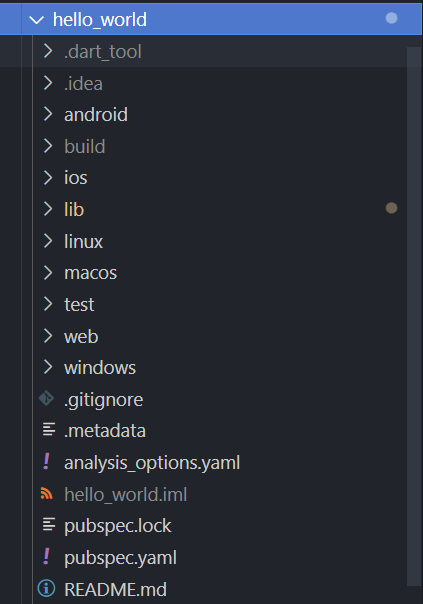

_Gambar 1. Project hello_world_

## Praktikum 2 - Menghubungkan Perangkat Android atau Emulator
Menjalankan aplikasi di perangkat Android menggunakan kabel.

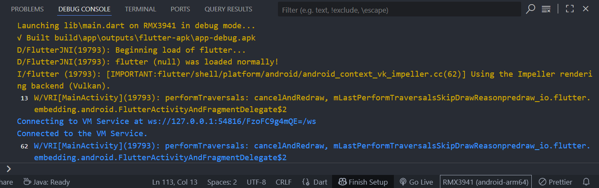

_Gambar 2. Debuging Flutter di Android_

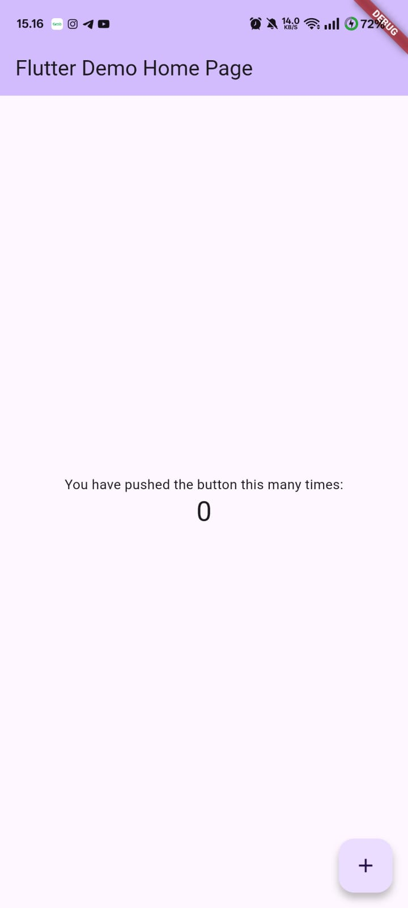

_Gambar 3. Output Debuging Flutter di Android_

## Praktikum 3 - Membuat Repository Github dan Laporan Praktikum
### Langkah 11
Kembali ke VS Code, ubah platform di pojok kanan bawah ke emulator atau device atau bisa juga menggunakan browser Chrome. Lalu coba running project hello_world dengan tekan F5 atau Run > Start Debugging. Tunggu proses kompilasi hingga selesai, maka aplikasi flutter pertama Anda akan tampil.

_Gambar 4. Ouput P3 Langkah 11_

### Langkah 12
Silakan screenshot seperti pada Langkah 11, namun teks yang ditampilkan dalam aplikasi berupa nama lengkap Anda.

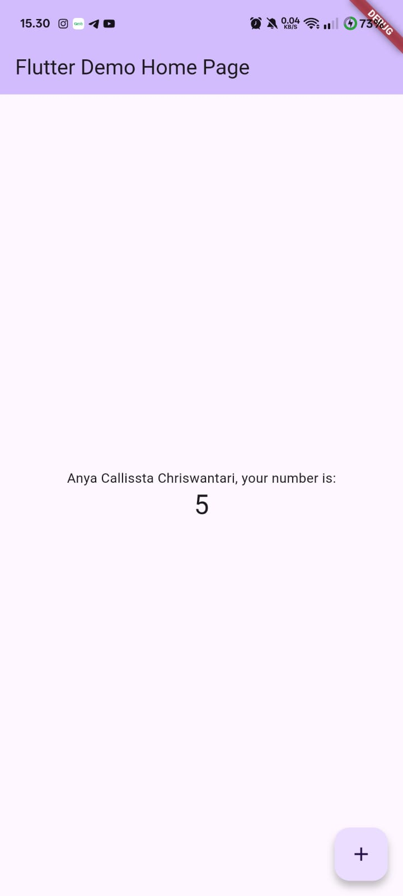

_Gambar 5. Ouput P3 Langkah 12_

## Praktikum 4 - Menerapkan Widget Dasar
### Langkah 1
Buat folder baru basic_widgets di dalam folder lib. Kemudian buat file baru di dalam basic_widgets dengan nama text_widget.dart. Lakukan import file text_widget.dart ke main.dart, lalu ganti bagian text widget dengan kode pada text_widget.

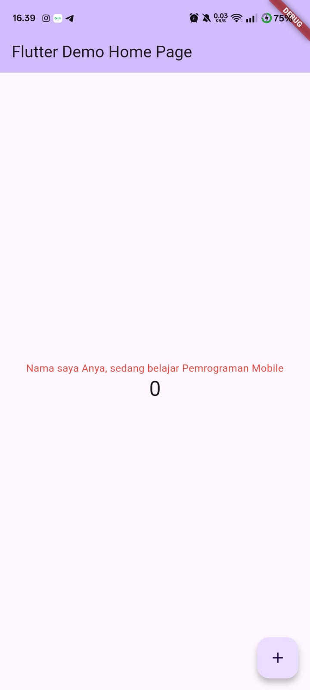

_Gambar 6. Ouput P4 Langkah 1_

### Langkah 2
Buat sebuah file image_widget.dart di dalam folder basic_widgets dengan isi kode berikut. Lakukan penyesuaian asset pada file pubspec.yaml dan tambahkan file logo Anda di folder assets project hello_world.

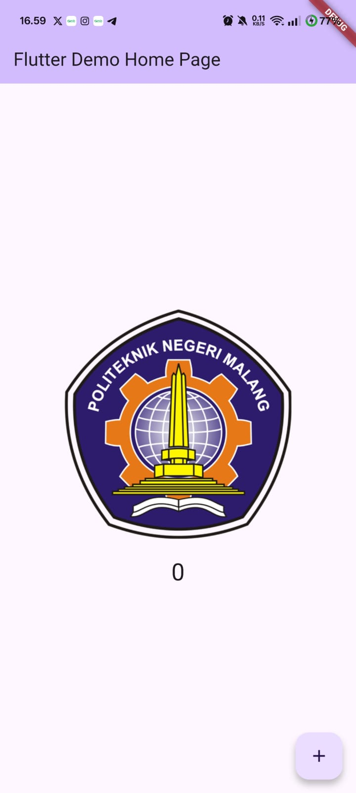

_Gambar 7. Ouput P4 Langkah 2_

## Praktikum 5 - Menerapkan Widget Material Design dan iOS Cupertino
### Langkah 1
Buat file di basic_widgets > loading_cupertino.dart. Import stateless widget dari material dan cupertino. 

_Gambar 8. Ouput P5 Langkah 1_

### Langkah 2
Button widget terdapat beberapa macam pada flutter yaitu ButtonBar, DropdownButton, TextButton, FloatingActionButton, IconButton, OutlineButton, PopupMenuButton, dan ElevatedButton. Buat file di basic_widgets > fab_widget.dart. Import stateless widget dari material.

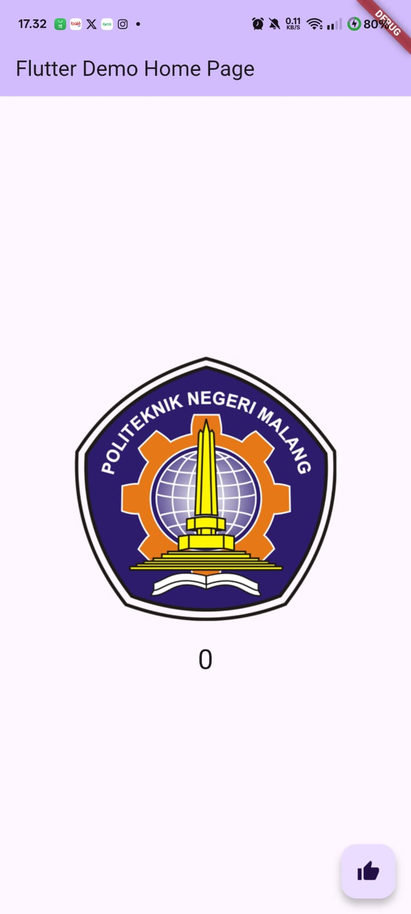

_Gambar 9. Ouput P5 Langkah 2_

### Langkah 3
Scaffold widget digunakan untuk mengatur tata letak sesuai dengan material design.

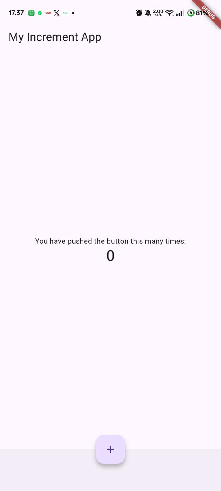

_Gambar 10. Ouput P5 Langkah 3_

### Langkah 4
Dialog widget pada flutter memiliki dua jenis dialog yaitu AlertDialog dan SimpleDialog

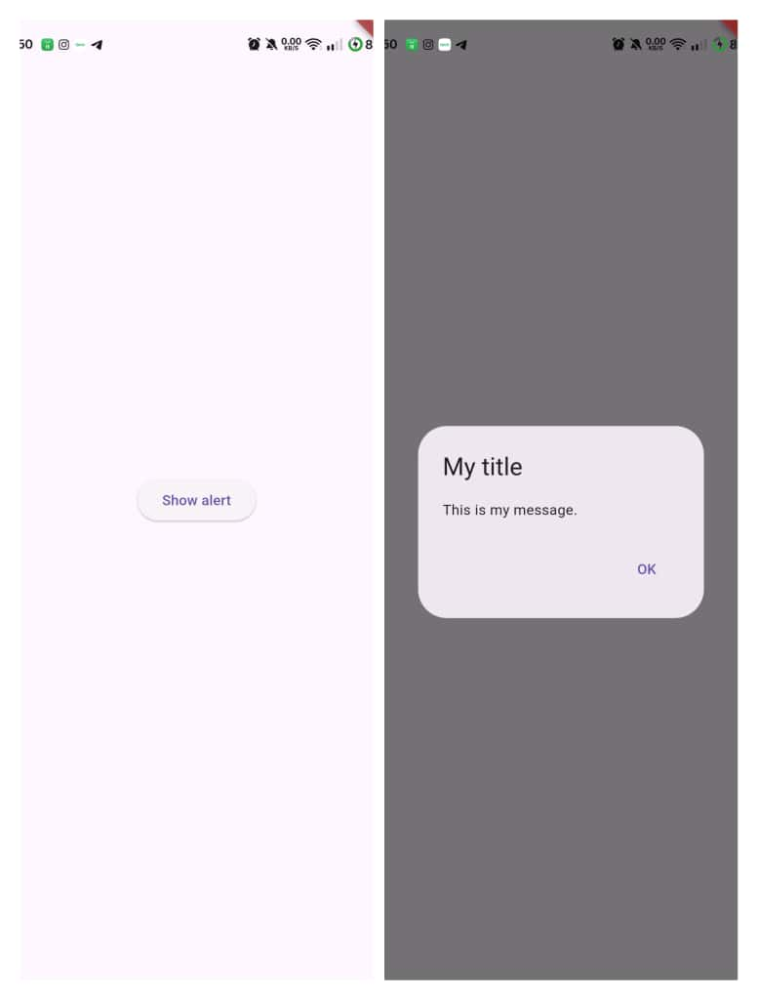

_Gambar 11. Ouput P5 Langkah 4_

### Langkah 5
Flutter menyediakan widget yang dapat menerima input dari pengguna aplikasi yaitu antara lain Checkbox, Date and Time Pickers, Radio Button, Slider, Switch, TextField.

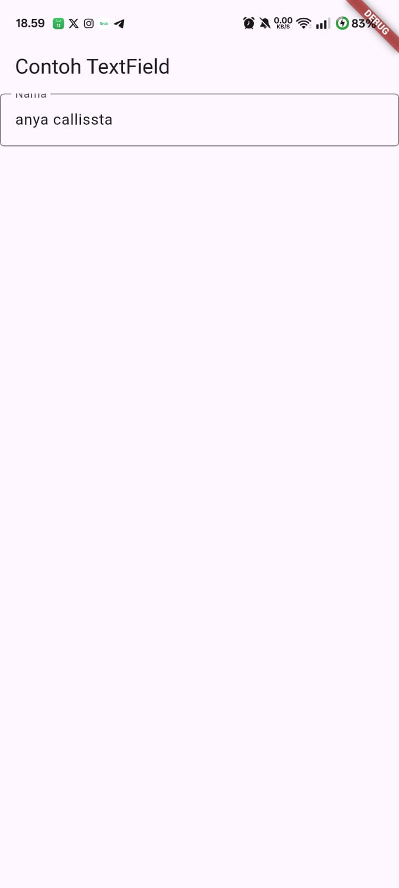

_Gambar 12. Ouput P5 Langkah 5_

### Langkah 6
Date and Time Pickers termasuk pada kategori input dan selection widget, berikut adalah contoh penggunaan Date and Time Pickers.

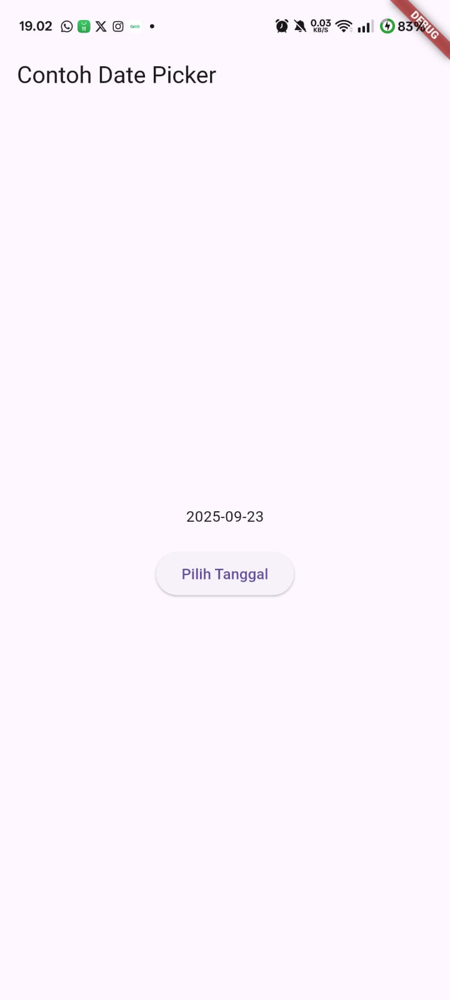

_Gambar 13. Ouput P5 Langkah 6_

## Tugas - Membuat Project namer_app
### Langkah 4 - Menambahkan Tombol
>Meluncurkan Aplikasi

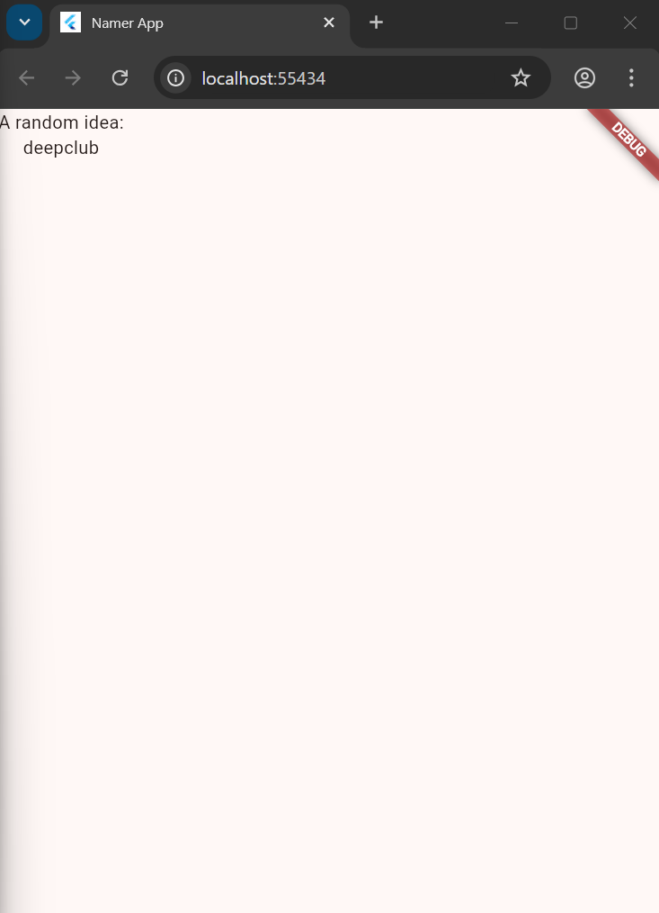

_Gambar 14. Meluncurkan Aplikasi_

>Hot Reload Pertama

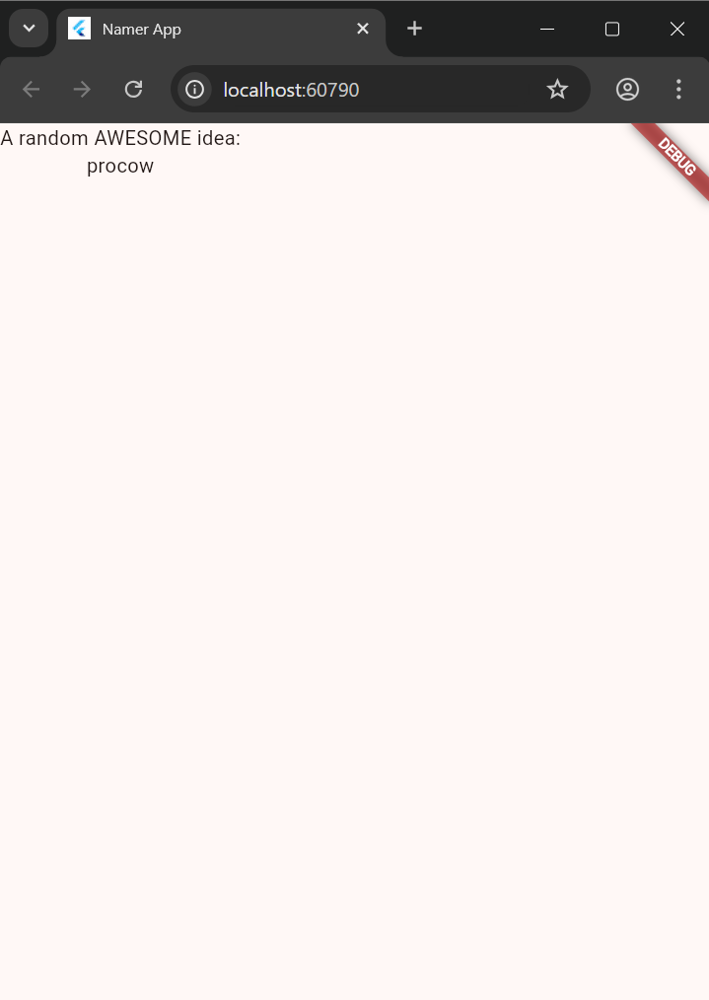

_Gambar 15. Hot Reload Pertama_

>Menambahkan Tombol

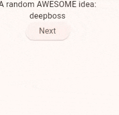

_Gambar 16. Menambahkan Tombol_

### Langkah 5 - Memperindah UI
>Menambahkan Kartu

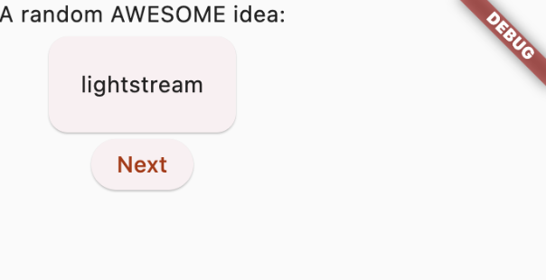

_Gambar 17. Menambahkan Kartu_

>Tema dan Gaya

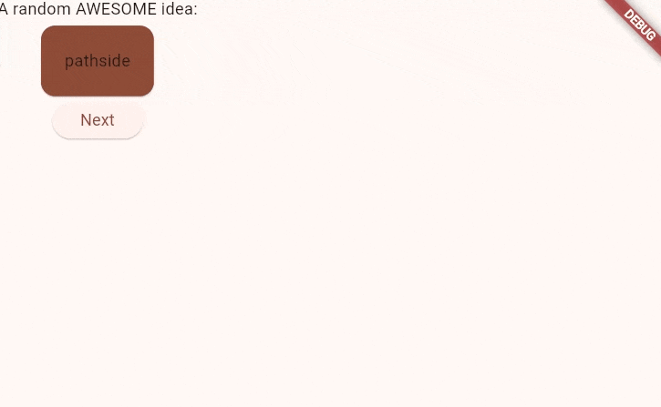

_Gambar 18. Tema dan Gaya_

>Tema Teks

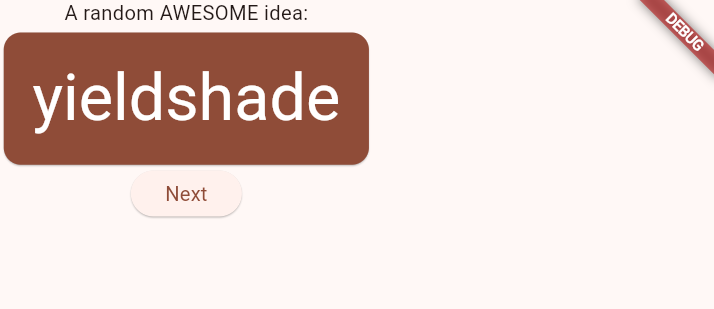

_Gambar 19. Tema Teks_

>Menempatkan UI di Tengah

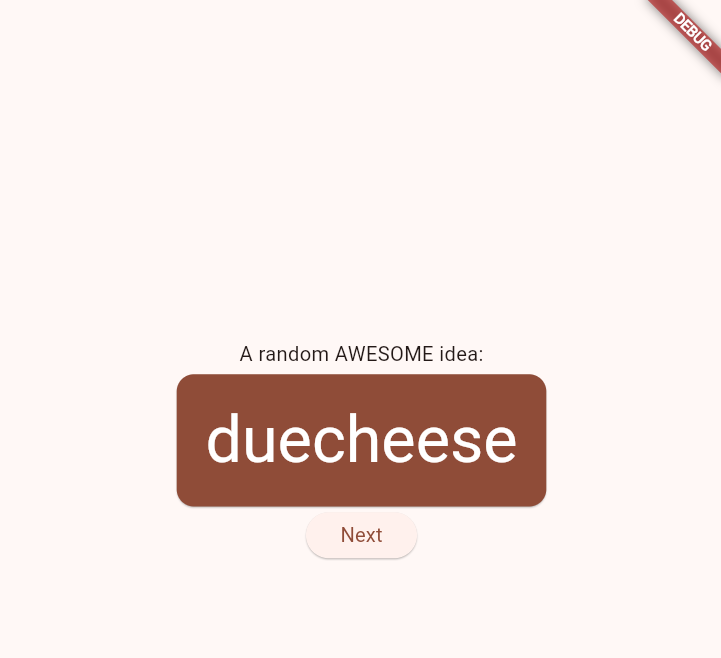

_Gambar 20. Menempatkan UI di Tengah_

### Langkah 6 - Menambahkan Fungsi
>Menambahkan Tombol Like

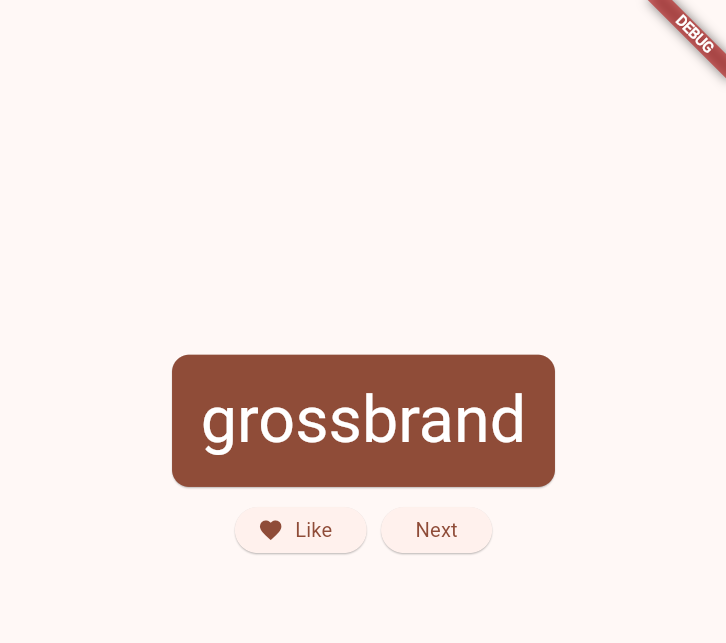

_Gambar 21. Menambahkan Tombol Like_

### Langkah 7 - Menambahkan Sidebar
>setState

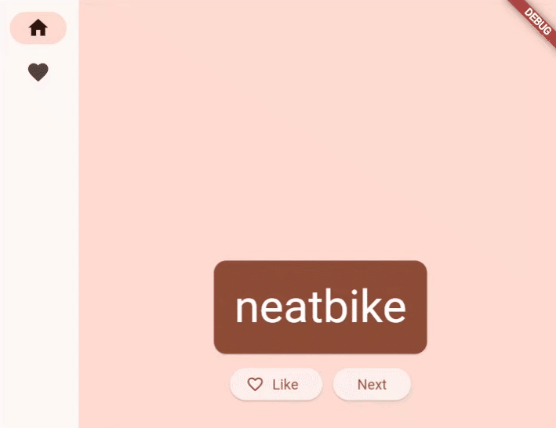

_Gambar 22. setState_

>Menggunakan Selected Index

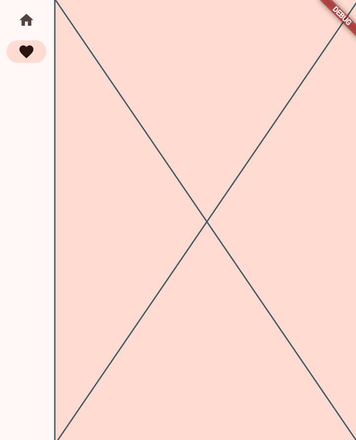

_Gambar 23. Menggunakan Selected Index_

>Tingkat Respon

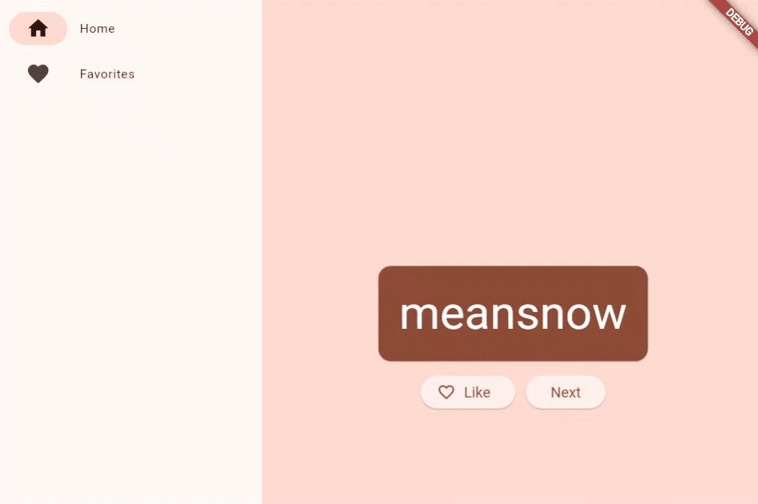

_Gambar 24. Tingkat Respon_

### Langkah 8 - Menambahkan Halaman Baru
>Menambahkan Halaman Like

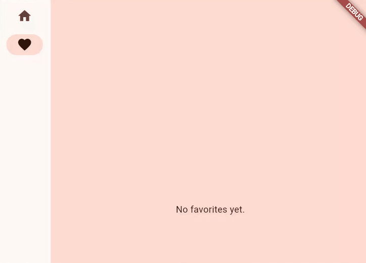

_Gambar 25. Menambahkan Halaman Like_