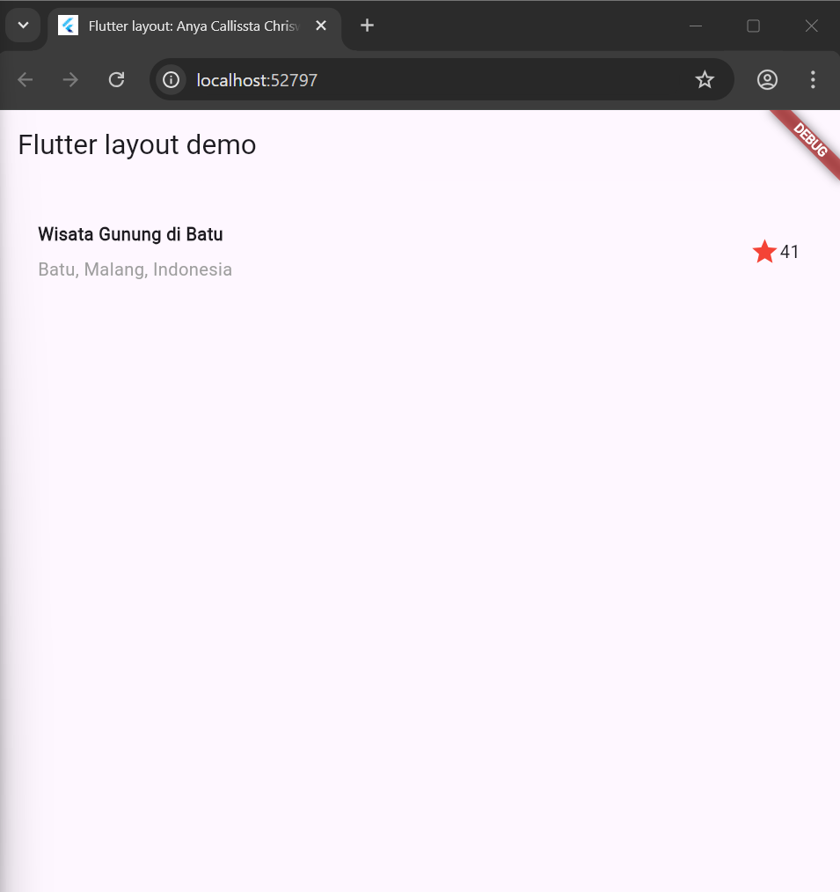
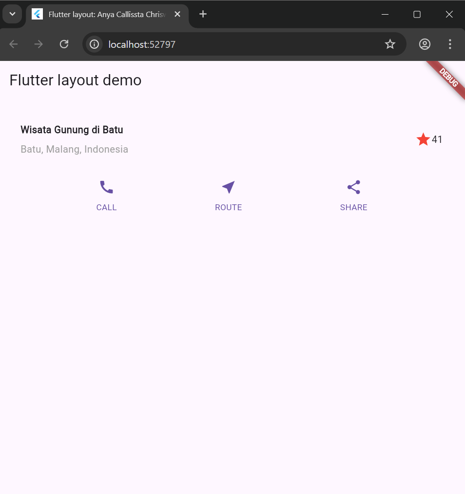
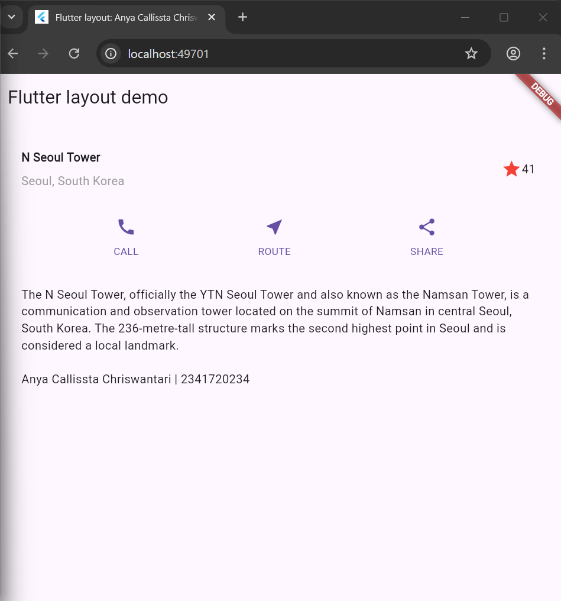
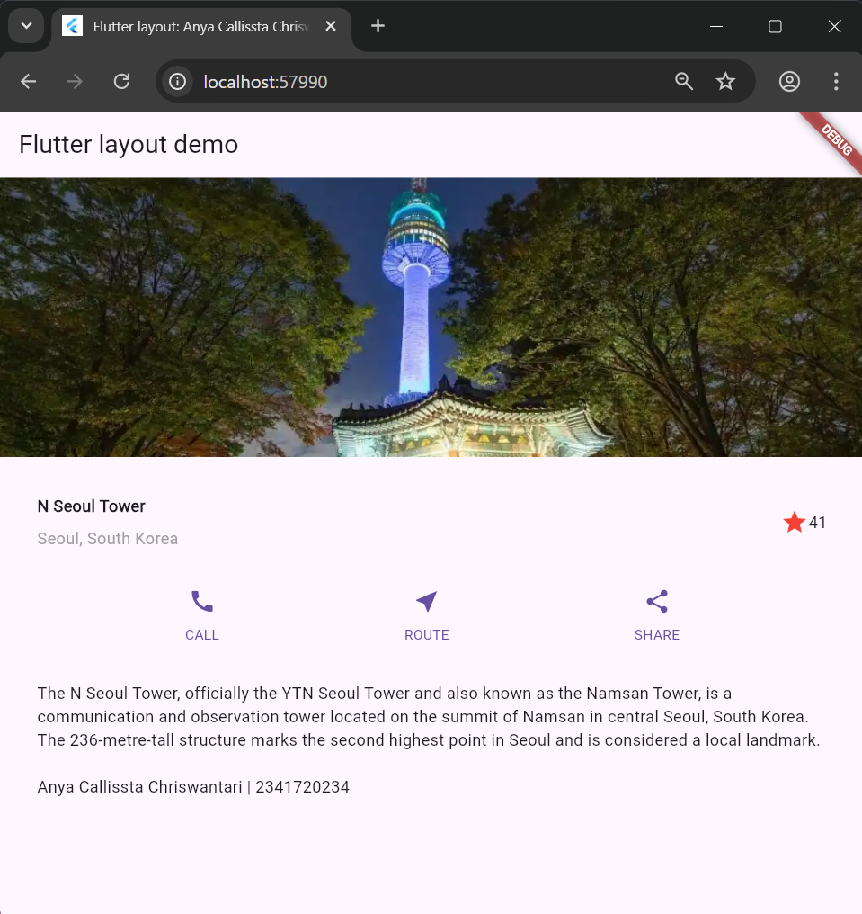

Nama : Anya Callissta Chriswantari
 NIM : 2341720234
 Kelas : TI 3G
 Absen : 05

---

# PEMROGRAMAN MOBILE - PERTEMUAN 6

## Praktikum 1 - Membangun Layout di FLutter

_Gambar 1. Output Praktikum 1_

## Praktikum 2 - Implementasi Button Row

_Gambar 2. Output Praktikum 2_

## Praktikum 3 - Implementasi Text Section

_Gambar 3. Ouput Praktikum 3_

## Praktikum 4 - Implementasi Image Section

_Gambar 4. Ouput Praktikum 4_

## Tugas 1

_Gambar 5. Ouput Tugas 1_

## Praktikum 5 - Membangun Navigasi di Flutter dan Tugas 2

_Gambar 6. Ouput Praktikum 5 dan Tugas 2_