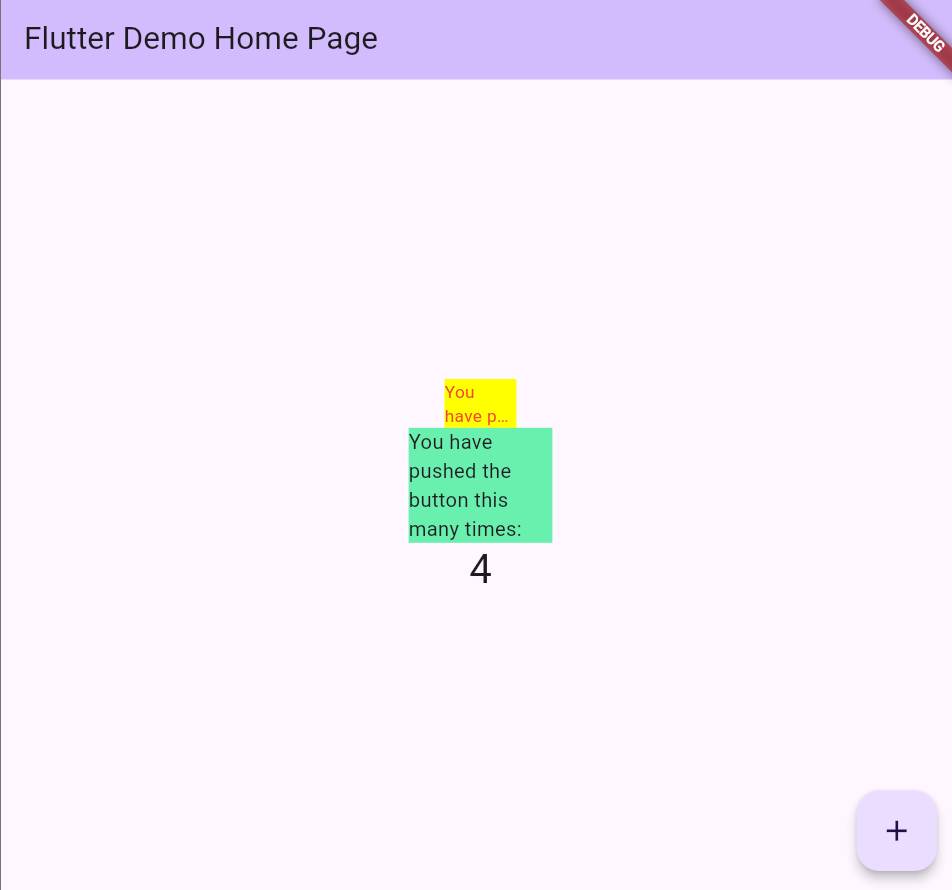

Nama : Anya Callissta Chriswantari
 NIM : 2341720234
 Kelas : TI 3G
 Absen : 05

---

# PEMROGRAMAN MOBILE - PERTEMUAN 7

## Praktikum

_Gambar 1. Ouput Praktikum_

2. Jelaskan maksud dari langkah 2 pada praktikum tersebut!
>Jawab:  Pada langkah 2 bertujuan untuk mengunduh dan menginstall plugin auto_size_text ke dalam proyek flutter. Setelah kode pada langkah 2 dijalankan, flutter akan menambahkan baris baru pada file pubspec.yaml pada bagian dependencies yang berfungsi mengunduh dan menginstall plugin (sama seperti perintah "flutter pub get").

3. Jelaskan maksud dari langkah 5 pada praktikum tersebut!
>Jawab:  Pada langkah 5 dilakukan pendefinisian data (text) yang akan ditampilkan oleh widget RedTextWidget dan memungkinkan widget menerima data melalui constructor. Hal ini dilakukan agar widget reusable dan fleksible.

4. Pada langkah 6 terdapat dua widget yang ditambahkan, jelaskan fungsi dan perbedaannya!
>Jawab:  Container dengan widget RedTextWidget  memberikan background berwarna kuning (yellowAccent) dan lebar tetap 50 piksel. Di dalamnya, ada RedTextWidget, yaitu custom widget yang sebelumnya kita buat RedTextWidget menampilkan teks dengan warna merah dan menggunakan AutoSizeText untuk menyesuaikan ukuran teks secara otomatis jika terlalu panjang.   Sedangkan Container dengan widget Text  memberikan background hijau muda dan lebar 100 px. Di dalamnya, hanya ada widget Text standar dari Flutter. Teks tidak otomatis menyesuaikan ukuran font jika panjang, maka bisa overflow (melebihi container) atau terpotong jika tidak diatur wrapping atau ellipsis.

5. Jelaskan maksud dari tiap parameter yang ada di dalam plugin auto_size_text berdasarkan tautan pada dokumentasi https://pub.dev/documentation/auto_size_text/latest/ !
>Jawab: 

| Parameter            | Tipe                | Penjelasan                                                                                                             |
|-----------------------|----------------------|-------------------------------------------------------------------------------------------------------------------------|
| `key`                | `Key?`             | Key untuk widget ini, digunakan Flutter untuk identifikasi unik dalam widget tree.                                     |
| `textKey`            | `Key?`             | Key khusus untuk widget `Text` internal yang digunakan oleh `AutoSizeText`.                                           |
| `style`              | `TextStyle?`       | Gaya teks awal (warna, ukuran font, fontWeight, dsb). Digunakan sebagai dasar penyesuaian ukuran font.                 |
| `minFontSize`        | `double`           | Ukuran font minimum yang diizinkan saat teks mengecil agar tetap muat.                                                |
| `maxFontSize`        | `double`           | Ukuran font maksimum yang diizinkan saat auto-sizing.                                                                 |
| `stepGranularity`    | `double`           | Besaran langkah perubahan ukuran font saat menyesuaikan teks. Semakin kecil semakin halus tetapi bisa mempengaruhi performa. |
| `presetFontSizes`    | `List<double>`     | Daftar ukuran font spesifik yang digunakan untuk auto-sizing. Jika diisi, parameter min/max/step akan diabaikan.      |
| `group`              | `AutoSizeGroup?`   | Mengelompokkan beberapa `AutoSizeText` agar semua menyesuaikan ukuran font secara seragam.                            |
| `textAlign`          | `TextAlign?`       | Menentukan perataan teks (kiri, kanan, tengah, justify), sama seperti di widget `Text`.                               |
| `textDirection`      | `TextDirection?`   | Arah teks (LTR atau RTL), memengaruhi interpretasi `start` dan `end`.                                                 |
| `locale`            | `Locale?`         | Locale teks, dapat memengaruhi pemilihan font atau karakter.                                                           |
| `softWrap`          | `bool`            | Menentukan apakah teks boleh dibungkus otomatis ke baris berikutnya.                                                  |
| `wrapWords`        | `bool`            | Jika `false`, kata yang tidak muat tidak akan dipotong ke baris berikutnya. Default `true`.                           |
| `overflow`          | `TextOverflow`    | Menentukan perilaku saat teks overflow, misalnya `ellipsis` atau `clip`.                                             |
| `overflowReplacement`| `Widget?`        | Widget alternatif yang ditampilkan jika teks tetap overflow meskipun sudah diperkecil maksimal.                       |
| `textScaleFactor`   | `double`         | Faktor skala teks (mis. mengikuti pengaturan aksesibilitas sistem).                                                   |
| `maxLines`         | `int?`          | Jumlah maksimum baris yang boleh ditampilkan. Teks akan diperkecil atau overflow jika melebihi.                        |
| `semanticsLabel`   | `String?`       | Label teks untuk screen reader (aksesibilitas). Bisa berbeda dari teks tampilan sebenarnya.                           |
