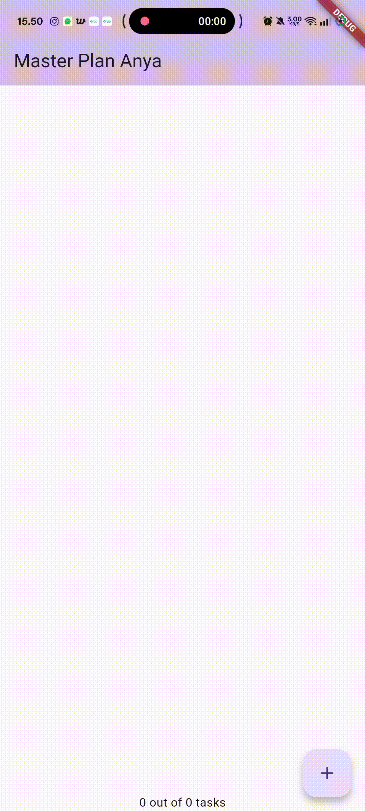
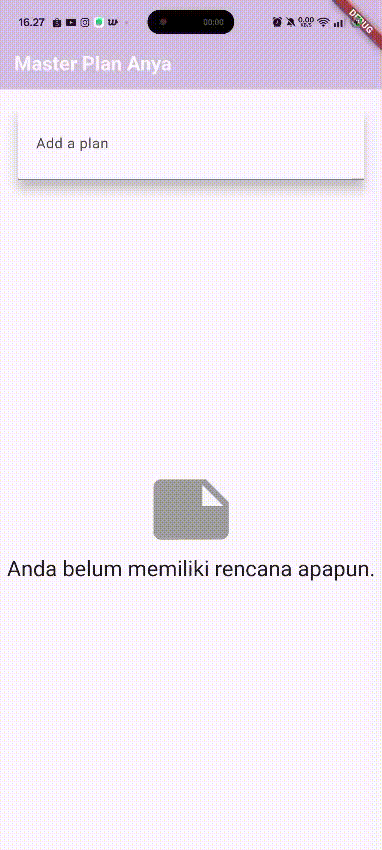

Nama : Anya Callissta Chriswantari
 NIM : 2341720234
 Kelas : TI 3G
 Absen : 05

---

# PEMROGRAMAN MOBILE - PERTEMUAN 10

## Tugas Praktikum 1

_Gambar 1. Ouput Praktikum 1_

2. Jelaskan maksud dari langkah 4 pada praktikum tersebut! Mengapa dilakukan demikian?
>Jawab: File data_layer.dart ini berfungsi sebagai “penghubung” (aggregator file) yang menampung ekspor dari beberapa model (plan.dart dan task.dart). Dengan menulis export, kita tidak perlu lagi mengimpor kedua file satu per satu di file lain.  Tujuannya adalah untuk menyederhanakan proses import ketika jumlah model bertambah banyak, memudahkan pengelolaan struktur proyek, dan menerapkan prinsip modularitas dan maintainability (mudah dirawat dan dikembangkan).

3. Mengapa perlu variabel plan di langkah 6 pada praktikum tersebut? Mengapa dibuat konstanta?
>Jawab: Variabel plan digunakan untuk menyimpan data utama yang sedang ditampilkan pada layar (PlanScreen), misalnya daftar tugas (tasks) dan nama rencana (name). Karena Plan berisi data yang akan berubah (seperti daftar tugas yang bertambah atau status selesai yang berubah), maka plan perlu disimpan di dalam State agar bisa di-update menggunakan setState().  Const dibuat untuk menunjukkan bahwa nilai awal plan bersifat tetap namun bisa diganti dengan setState().

4. Lakukan capture hasil dari Langkah 9 berupa GIF, kemudian jelaskan apa yang telah Anda buat!

_Gambar 2. Ouput Praktikum 1_
>Jawab: Pada langkah tersebut dibuat kode _buildTaskTile(Task task, int index) berfungsi untuk menampilkan satu item tugas (task) dalam bentuk ListTile yang berisi checkbox untuk menandai apakah tugas sudah selesai dan textFormField untuk menampilkan dan mengubah deskripsi tugas. Ketika checkbox atau teks diubah, fungsi setState() akan membuat objek Plan baru dengan data terbaru (tanpa mengubah langsung objek lama), lalu memperbarui tampilan agar perubahan terlihat di layar.

5. Apa kegunaan method pada Langkah 11 dan 13 dalam lifecyle state ?
>Jawab: initState() dipakai untuk menyiapkan data atau controller yang hanya perlu dibuat sekali di awal siklus hidup widget. Sedangkan dispose() digunakan untuk menutup atau membersihkan semua resource yang dibuat di initState() saat widget tidak lagi digunakan.

## Tugas Praktikum 2

_Gambar 3. Ouput Praktikum 2_

2. Jelaskan mana yang dimaksud InheritedWidget pada langkah 1 tersebut! Mengapa yang digunakan InheritedNotifier?
>Jawab: InheritedWidget adalah widget khusus di Flutter yang digunakan untuk menyediakan data ke seluruh subtree widget (widget-widget anak di bawahnya) tanpa harus meneruskan data secara manual lewat konstruktor.

3. Jelaskan maksud dari method di langkah 3 pada praktikum tersebut! Mengapa dilakukan demikian?
>Jawab: completedCount adalah getter yang menghitung berapa banyak tugas (task) yang sudah selesai. Menggunakan fungsi where() untuk memfilter task dengan complete == true, lalu menghitung jumlahnya dengan .length. Sedangkan completenessMessagem adalah getter untuk membuat pesan teks ringkas berdasarkan hasil hitung di atas. Langkah di atas dilakukan untuk menampilkan progres penyelesaian tugas di UI.

4. Lakukan capture hasil dari Langkah 9 berupa GIF, kemudian jelaskan apa yang telah Anda buat!

_Gambar 4. Ouput Praktikum 2_

## Tugas Praktikum 3

_Gambar 5. Ouput Praktikum 3_

2. Berdasarkan Praktikum 3 yang telah Anda lakukan, jelaskan maksud dari gambar diagram berikut ini!
>Jawab: Diagram kiri menunjukkan alur pembuatan plan, mulai dari memasukkan data hingga menampilkan daftar task yang sedang dibuat, sedangkan diagram kanan menunjukkan alur tampilan plan yang sudah dibuat, menampilkan daftar task dengan UI yang interaktif dan aman untuk berbagai ukuran layar.  Hubungan kedua diagram adalah Navigator Push menghubungkan kedua layar, dari PlanCreatorScreen (membuat plan) ke PlanScreen (menampilkan plan), Data Flow adalah data plan yang dibuat di PlanCreatorScreen diteruskan melalui PlanProvider, sehingga PlanScreen bisa membaca dan menampilkan daftar task dengan mudah.

3. Lakukan capture hasil dari Langkah 14 berupa GIF, kemudian jelaskan apa yang telah Anda buat!
>Jawab: Widget _buildMasterPlans() berfungsi menampilkan daftar rencana (Plan) yang diambil dari PlanProvider. Jika daftar rencana kosong, widget menampilkan ikon dan teks pemberitahuan bahwa pengguna belum memiliki rencana apapun. Jika daftar tidak kosong, widget menampilkan ListView yang scrollable, di mana setiap item (ListTile) menampilkan nama plan dan pesan kelengkapannya, serta bisa diklik untuk membuka halaman detail PlanScreen dari plan yang dipilih. Jadi, widget ini menangani tampilan dinamis baik untuk kondisi kosong maupun berisi data, sekaligus memungkinkan navigasi ke detail plan.
