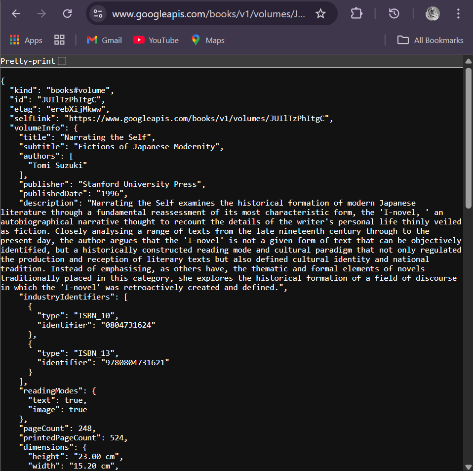
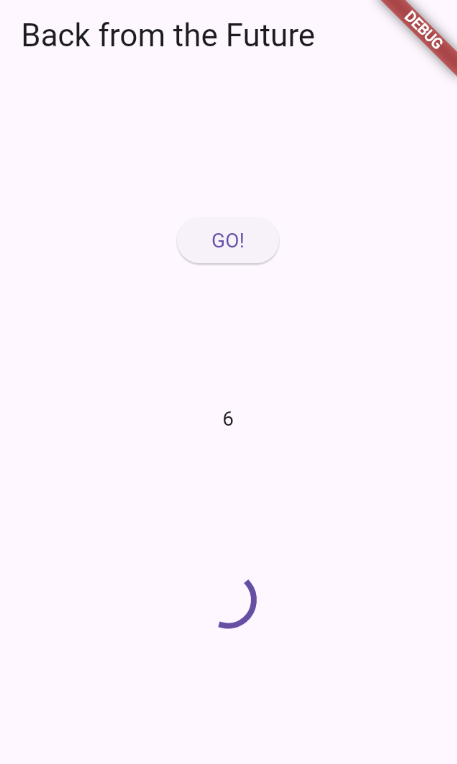
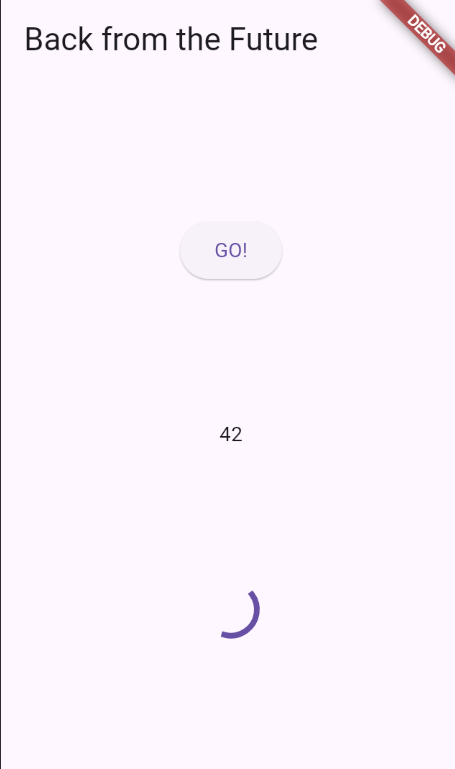
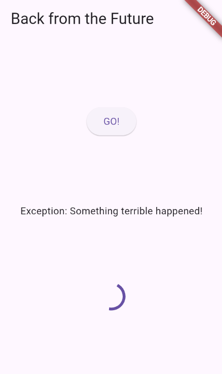
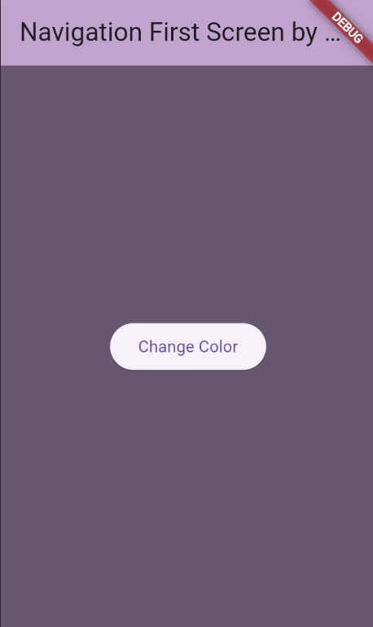
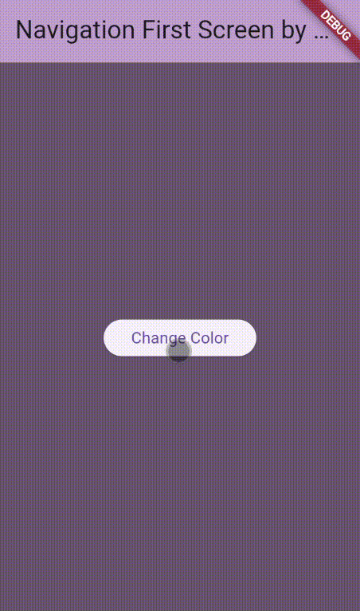

Nama : Anya Callissta Chriswantari
 NIM : 2341720234
 Kelas : TI 3G
 Absen : 05

---

# PEMROGRAMAN MOBILE - PERTEMUAN 11

## Praktikum 1 - Mengunduh Data dari Web Service (API)

### Soal 1
Tambahkan nama panggilan Anda pada title app sebagai identitas hasil pekerjaan Anda.

_Gambar 1. Ouput Praktikum 1 Soal 1_

### Soal 2
Carilah judul buku favorit Anda di Google Books, lalu ganti ID buku pada variabel path di kode tersebut. Kemudian cobalah akses di browser URI tersebut untuk menampilkan data JSON.

_Gambar 2. Ouput Praktikum 1 Soal 2_

### Soal 3

_Gambar 3. Ouput Praktikum 1 Soal 3_

Jelaskan maksud kode langkah 5 tersebut terkait substring dan catchError!
>Jawab: Kode substring digunakan untuk memproses data yang berhasil diterima dari jaringan. .substring(0, 450) merupakan fungsi string yang digunakan untuk mengambil sebagian kecil dari string asli agar hasil respons tidak memuni layar, 0 berarti indeks karakter pertama dan 450 adalah indeks karakter terakhir. Hasil dari kode tersebut akan mengambil 450 karakter pertama dari data yang diterima.   catchError digunakan untuk menangani error. Kode ini akan dipanggil jika getData() gagal. Simbol _ menunjukkan bahwa objek error tidak digunakan, tetapi mengetahui adanya kesalahan. Jika terjadi kesalahan, variabel result diatur menjadi string 'An error occurred'dan setState(() {}) dipanggil untuk menampilkan pesan kesalahan yang ramah pengguna ini di UI.

## Praktikum 2 - Menggunakan await/async untuk Menghindari Callbacks

### Soal 4

_Gambar 4. Ouput Praktikum 2 Soal 4_

Jelaskan maksud kode langkah 1 dan 2 tersebut!
>Jawab: Kode langkah 1 berisi tiga fungsi (returnOneAsync, returnTwoAsync, dan returnThreeAsync) adalah fungsi asinkron yang masing-masing didefinisikan untuk mensimulasikan operasi yang memakan waktu selama 3 detik menggunakan await Future.delayed(const Duration(seconds: 3)). Kata kunci async dan tipe kembalian Future<int> menandakan bahwa fungsi-fungsi ini beroperasi tanpa memblokir thread utama aplikasi (seperti UI di Flutter), dan setelah penantian 3 detik selesai, masing-masing akan mengembalikan nilai integer yang berbeda (1, 2, atau 3). Tujuannya adalah untuk mendemonstrasikan dan menguji penanganan alur kerja asinkron, baik secara sekuensial maupun bersamaan.   Kode langkah 2 berisi fungsi asinkron untuk menjalankan tiga operasi asinkron pada langkah 1 secara berurutan dan menjumlahkan hasilnya sebelum memperbarui UI pengguna. Nilai 6 yang dihasilkan pada output merupakan hasil penjumlahan dari return value pada langkah 1 yaitu 1+2+3=6.

## Praktikum 3 - Menggunakan Completer di Future

### Soal 5

_Gambar 5. Ouput Praktikum 3 Soal 5_

Jelaskan maksud kode langkah 2 tersebut!
>Jawab: Kode langkah 2 berguna untuk membuat dan mengontrol Future secara manual menggunakan class Completer dengan cara memisahkan permintaan nilai (getNumber) dan penyelesaian nilainya (calculate). Pada langkah ini getNumber() mengembalikan Future dan 5 detik kemudian, calculate() mengisi Future dengan nilai 42.

### Soal 6

_Gambar 6. Ouput Praktikum 3 Soal 6_

Jelaskan maksud perbedaan kode langkah 2 dengan langkah 5-6 tersebut!
>Jawab: Perbedaan terletak pada penanganan error dalam fungsi calculate() dan error dari Future yang dihasilkan. Pada langkah 2 fungsi calculate() tidak memiliki try-catch, sehingga jika terjadi kesalahan internal, program akan mengalami unhandled exception yang dapat menyebabkan aplikasi crash. Sedangkan pada langkah 5-6 error ditangani secara eksplisit di dalam calculate() menggunakan try-catch dan completer.completeError() dan .catchError() untuk menampilkan pesan kesalahan yang aman kepada pengguna, memastikan aplikasi tidak crash bahkan saat operasi asinkron gagal.

## Praktikum 4 - Memanggil Future Secara Paralel

### Soal 7

_Gambar 7. Ouput Praktikum 4 Soal 7_

### Soal 8 
Jelaskan maksud perbedaan kode langkah 1 dan 4!
>Jawab: Kode langkah 1 menggunakan class FutureGroup dari package eksternal (package:aync) serta kode lebih panjang dan multi langkah. Sedangkan kode langkah 4 menggunakan fungsi statis Future.wait<T>() bawaan dart (dart:async) serta kode lebih ringkas dan fungsional.

## Praktikum 5 - Menangani Respon Error pada Async Code

### Soal 9

_Gambar 8. Ouput Praktikum 5 Soal 9_

### Soal 10

_Gambar 9. Ouput Praktikum 5 Soal 10_

Jelaskan perbedaan kode langkah 1 dan 4!
>Jawab: Perbedaan kode terletak pada gaya penanganan asinkronitas dan error. Kode langkah 1 menggunakan metode berantai (.then(), .catchError()) pada objek Future, sedangkan kode langkah 4 menggunakan pola async/await dengan blok try-catch-finally yang lebih mirip dengan kode sinkron tradisional.

## Praktikum 6 - Menggunakan Future dengan StatefulWidget

### Soal 11

_Gambar 10. Ouput Praktikum 6 Soal 11_

### Soal 12

_Gambar 11. Ouput Praktikum 6 Soal 12_

Apakah Anda mendapatkan koordinat GPS ketika run di browser? Mengapa demikian?
>Jawab: Iya, koordinat GPS tetap tampil ketika run menggunakan browser. Flutter Web berhasil mendapatkan lokasi GPS karena package geolocator secara otomatis mengintegrasikan diri dengan Web Geolocation API standar yang disediakan oleh browser. Saat kode memanggil Geolocator.requestPermission() dan Geolocator.getCurrentPosition(), Chrome akan menampilkan dialog izin lokasi browser kepada pengguna, dan setelah diizinkan, browser menggunakan sumber lokasi yang tersedia pada perangkat (Wi-Fi atau data IP) untuk memberikan koordinat kembali ke aplikasi Flutter.

## Praktikum 7 - Manajemen Future dengan FutureBuilder

### Soal 13

_Gambar 12. Ouput Praktikum 7 Soal 13_

Apakah ada perbedaan UI dengan praktikum sebelumnya? Mengapa demikian?
>Jawab: Tidak ada, karena perubahan kode yang dilakukan bukan mengubah tampilan. Perbedaan terletak pada mekanisme pengelolaan state asinkron dan waktu update UI.

### Soal 14

_Gambar 13. Ouput Praktikum 7 Soal 14_

Apakah ada perbedaan UI dengan praktikum sebelumnya? Mengapa demikian?
>Jawab: Tidak ada, karena perubahan kode yang dilakukan bukan mengubah tampilan. Perbedaan terletak pada cara penanganan dan penyajian hasil error saat Future gagal diselesaikan.

## Praktikum 8 - Navigation Route Dengan Future Function

### Soal 15

_Gambar 14. Ouput Praktikum 8 Soal 15_

### Soal 16

_Gambar 15. Ouput Praktikum 8 Soal 16_

Cobalah klik setiap button, apa yang terjadi ? Mengapa demikian ?
>Jawab: Warna background berubah sesuai dengan buttond yang diklik. Hal itu terjadi karena pada langkah 5 mengimplementasikan pengembalian data (returning data) saat melakukan navigasi dan menggabungkannya dengan pembaruan state asinkron di layar pertama. Secara spesifik, saat tombol warna diklik di NavigationSecond, Navigator.pop(context, color) menghapus layar tersebut sambil mengirimkan objek warna yang dipilih kembali ke fungsi _navigateAndGetColor di NavigationFirst. Fungsi ini, yang sedang await hasil dari Navigator.push, kemudian menyimpan warna yang dikembalikan ke variabel state color dan memanggil setState({}), yang memaksa Scaffold di layar utama untuk di-rebuild dengan warna background yang baru.

## Praktikum 9 - Memanfaatkan async/await dengan Widget Dialog

### Soal 17

_Gambar 16. Ouput Praktikum 9 Soal 17_

Cobalah klik setiap button, apa yang terjadi ? Mengapa demikian ?
>Jawab: Warna background berubah sesuai button yang diklik. Hal itu terjadi karena implementasi pola pengembalian data (returning data) dari popup dialog dan menggunakannya untuk memicu pembaruan state pada layar. Ketika tombol "Change Color" diklik, fungsi asinkron _showColorDialog akan menampilkan AlertDialog menggunakan showDialog. Eksekusi kode berhenti di baris await showDialog. Setelah menakan button warna (misalnya, "Red"), callback tombol tersebut memanggil Navigator.pop(context, Colors.red.shade700), yang menutup dialog dan mengembalikan objek warna tersebut. Warna yang dikembalikan kemudian diterima oleh fungsi pemanggil (selectedColor), disimpan ke variabel state color, dan memicu setState({}), yang memaksa widget utama (Scaffold) untuk dibangun ulang dengan backgroundColor: color yang baru.