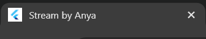
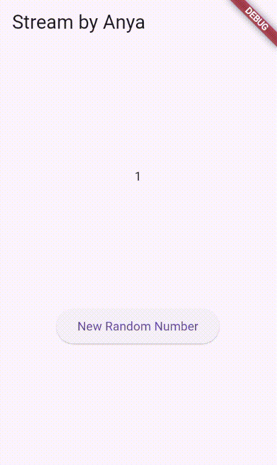
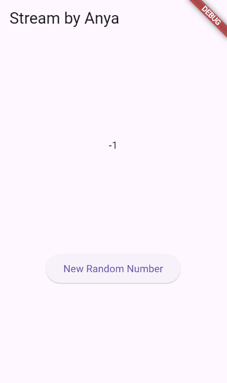
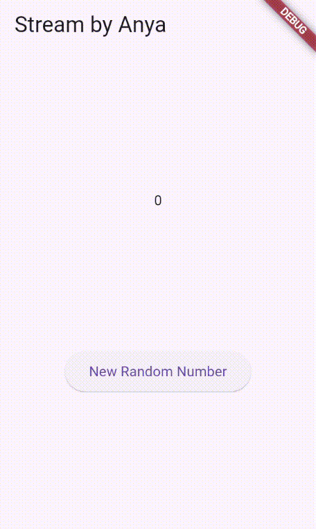
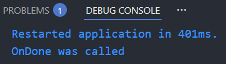
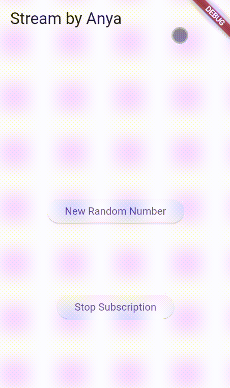
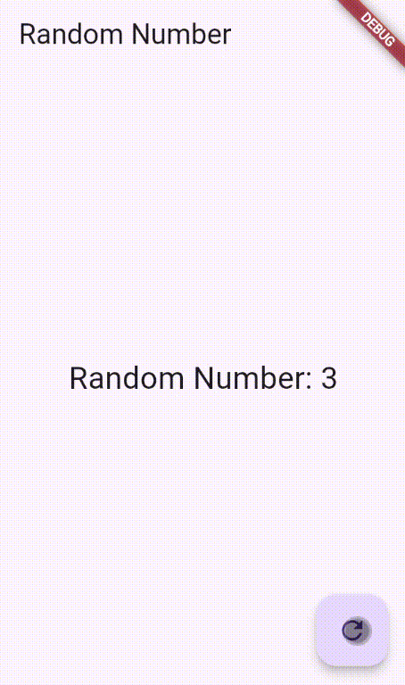

Nama : Anya Callissta Chriswantari
<br>NIM : 2341720234
<br>Kelas : TI 3G
<br>Absen : 05

---

# PEMROGRAMAN MOBILE - PERTEMUAN 12

## Praktikum 1 - Dart Streams
### Soal 1
Tambahkan nama panggilan Anda pada title app sebagai identitas hasil pekerjaan Anda.<br>


_Gambar 1. Ouput Praktikum 1 Soal 1_

### Soal 2
Tambahkan 5 warna lainnya sesuai keinginan Anda pada variabel colors tersebut.

>Jawab: 
```dart
final List<Color> colors = [
    Colors.blueGrey,
    Colors.amber,
    Colors.deepPurple,
    Colors.lightBlue,
    Colors.teal,
    Colors.indigoAccent,
    Colors.lime,
    Colors.pinkAccent,
    Colors.orange,
    Colors.purpleAccent,
  ];
```

### Soal 3
- Jelaskan fungsi keyword yield* pada kode tersebut!
    >Jawab: yield* digunakan di dalam async generator untuk meneruskan hasil dari stream lain ke stream saat ini.
- Apa maksud isi perintah kode tersebut?
    >Jawab: Stream.periodic(Duration(seconds: 1), ...) membuat stream yang setiap 1 detik mengeluarkan warna berikutnya dalam list colors, secara berulang (looping).

### Soal 4


_Gambar 2. Ouput Praktikum 1 Soal 4_

### Soal 5
Jelaskan perbedaan menggunakan listen dan await for (langkah 9)!
>Jawab: `listen()` digunakan untuk menerima data stream tanpa menunggu. Fungsi tetap berjalan dan event diproses melalui callback setiap kali stream mengirimkan data, sehingga cocok untuk pembaruan UI yang berjalan terus-menerus. <br>Sebaliknya, `await for` membuat fungsi berhenti dan menunggu setiap event dari stream secara berurutan sampai stream selesai atau ditutup; jika stream tidak pernah ditutup, eksekusi tidak akan berlanjut ke baris berikutnya. Jadi, `listen()` bersifat non-blocking dan bekerja di background, sementara `await for` bersifat blocking sampai stream berakhir.


## Praktikum 2 - Stream Controllers dan Sinks
### Soal 6


_Gambar 3. Ouput Praktikum 2 Soal 6_

Jelaskan maksud kode langkah 8 dan 10 tersebut!
>Jawab: Langkah 8: Membuat sebuah objek NumberStream, lalu mengambil StreamController miliknya melalui numberStream.controller. Dari controller tersebut diambil stream-nya menggunakan numberStreamController.stream, kemudian dipasang listener dengan stream.listen(...). Setiap kali stream mengeluarkan angka baru (eventNumber), fungsi callback di dalam listen akan dijalankan, dan setState() akan meng-update nilai lastNumber di UI. Intinya, kode ini menyiapkan listener yang selalu memantau angka baru dari stream dan memperbarui tampilan aplikasi setiap kali ada data masuk. <br>Langkah 10: Fungsi addRandomNumber() menghasilkan sebuah angka acak antara 0–9 menggunakan Random().nextInt(10), lalu angka tersebut dikirimkan ke stream melalui numberStream.addNumberToSink(myNum). Metode addNumberToSink() biasanya berisi controller.sink.add(myNum), sehingga angka acak itu akan masuk ke stream dan otomatis diterima oleh listener yang sudah dibuat sebelumnya. Jadi fungsi ini bertugas menghasilkan angka acak dan mengirimkannya ke stream agar UI dapat bereaksi terhadap perubahan tersebut.

### Soal 7


_Gambar 4. Ouput Praktikum 2 Soal 7_

Jelaskan maksud kode langkah 13-15 tersebut!
>Jawab: Langkah 13: Fungsi addError() mengirimkan event error ke dalam stream menggunakan controller.sink.addError(). Artinya, alih-alih mengirim data biasa, fungsi ini memasukkan sebuah error (dalam kasus ini string 'error') ke aliran stream, sehingga listener dapat mendeteksi bahwa terjadi kesalahan. <br>Langkah 14: Error handler pada listener stream. Jika stream menerima error yang dikirim dari langkah 13, callback onError akan dijalankan. Di dalamnya, UI di-update menggunakan setState() dan nilai lastNumber diubah menjadi -1, sebagai tanda bahwa terjadi error ketika membaca data stream. <br>Langkah 15: Pada langkah ini, objek Random dibuat (meskipun tidak digunakan dalam potongan kode ini), kemudian numberStream.addError() dipanggil. Pemanggilan ini akan memicu fungsi pada langkah 13, yaitu mengirim event error ke stream, yang pada gilirannya akan langsung ditangani oleh bagian onError pada langkah 14.

## Praktikum 3 - Injeksi Data ke Streams
### Soal 8


_Gambar 5. Ouput Praktikum 3 Soal 8_

Jelaskan maksud kode langkah 1-3 tersebut!
>Jawab: Langkah 1: Mendeklarasikan variabel transformer bertipe StreamTransformer, namun belum langsung diberi nilai. Kata kunci late digunakan agar variabel tersebut boleh diinisialisasi belakangan, tapi tetap dianggap non-nullable. Intinya, kamu memberi tahu Dart bahwa transformer akan dibuat nanti sebelum dipakai. <br>Langkah 2: Pembuatan StreamTransformer yang berfungsi untuk mengubah data sebelum dikirim ke listener, mengganti error dengan nilai tertentu, dan menutup stream ketika selesai. <br>Langkah 3: Stream asli diproses melalui transformer menggunakan .transform(transformer). Jadi setiap data, error, atau event finish dari stream akan melewati transformer dahulu, baru masuk ke listener.

## Praktikum 4 - Subscribe ke Stream Event
### Soal 9


_Gambar 6. Ouput Praktikum 4 Soal 9_

Jelaskan maksud kode langkah 2, 6 dan 8 tersebut!
>Jawab: Langkah 2: `numberStream = NumberStream();`: Membuat objek stream khusus yang kamu buat sendiri. `numberStreamController = numberStream.controller;`: Mengambil StreamController dari objek NumberStream. `Stream stream = numberStreamController.stream();`: Mengambil stream dari controller, yaitu aliran data yang akan dipantau.`subscription = stream.listen(...)`: Membuat subscription yang mendengarkan stream. Setiap kali ada angka baru, callback dijalankan dan UI di-update melalui setState() untuk mengganti nilai lastNumber. <br>Langkah 6: Baris ini menghentikan listener dari stream. Setelah cancel() dipanggil stream tidak lagi mengirim event ke listener, callback setState() tidak lagi dipanggil, dan UI tidak akan menerima pembaruan angka baru. <br>Langkah 8: Membuat generator yang menghasilkan angka acak (0-9) dan mencoba mengirimnya ke stream, tetapi hanya jika stream masih terbuka; jika sudah ditutup, UI akan menampilkan -1 sebagai indikator error.

## Praktikum 5 - Multiple Stream Subscriptions
### Soal 10
Jelaskan mengapa error itu bisa terjadi?
>Jawab: Error tersebut muncul karena satu Stream hanya boleh didengarkan (listen) sekali, kecuali stream tersebut bertipe broadcast. Kedua baris di atas mencoba melakukan dua listener pada stream yang sama, yaitu stream. Tetapi, default dari sebuah Stream di Dart adalah single-subscription stream.

### Soal 11


_Gambar 7. Ouput Praktikum 5 Soal 11_

Jelaskan mengapa hal itu bisa terjadi?
>Jawab: Hal tersebut terjadi karena ketika stream diubah menjadi broadcast menggunakan `asBroadcastStream()`, stream tersebut dapat memiliki lebih dari satu listener secara bersamaan. Setiap kali button `New Random Number` ditekan akan mengirim satu event ke stream. Karena ada 2 listener maka listener 1 menerima event dan menambahkan "angka -" ke values dan listener 2 menerima event dan menambahkan lagi "angka -" ke values.


## Praktikum 6 - StreamBuilder
## Soal 12


_Gambar 8. Ouput Praktikum 6 Soal 12_

Jelaskan maksud kode pada langkah 3 dan 7 !
>Jawab: Langkah 3: getNumbers() adalah metod async generator yang menghasilkan stream berisi angka acak setiap 1 detik. Bagian Stream.periodic memicu callback setiap satu detik sekali, dan di dalamnya dibuat objek Random untuk menghasilkan angka antara 0–9. Kata kunci yield* digunakan untuk meneruskan seluruh event dari stream periodic tersebut ke stream yang dihasilkan oleh getNumbers(). Dengan kata lain, metode ini menghasilkan aliran angka acak yang berubah setiap detik. <br>Langkah 7: StreamBuilder digunakan untuk mendengarkan stream dari langkah 3 dan membangun ulang UI setiap kali ada data baru. initialData: 0 membuat angka 0 ditampilkan sementara sebelum stream mengirim nilai pertama. Di dalam builder, jika stream mengirim error maka dicetak pesan ke console, namun UI tetap lanjut membangun. Jika snapshot memiliki data (angka acak dari stream), UI menampilkan angka tersebut dengan ukuran font besar. Jika belum ada data sama sekali, widget kosong (SizedBox.shrink()) ditampilkan. Intinya, StreamBuilder bertugas mendengarkan stream angka acak dan memperbarui tampilan setiap detik.

## Praktikum 7 - BLoC Pattern
## Soal 13


_Gambar 9. Ouput Praktikum 7 Soal 13_

Jelaskan maksud praktikum ini ! Dimanakah letak konsep pola BLoC-nya ?
>Jawab: Praktikum tersebut menampilkan angka acak (0–9) ke layar. Ketika pengguna menekan tombol FloatingActionButton, maka angka baru dihasilkan melalui BLoC, lalu UI otomatis memperbarui tampilan menggunakan StreamBuilder. Konsep BLoC berada pada pembagian: Event/input → _generateRandomController. Logic → menghasilkan angka acak di listener. State/output → _randomNumberController