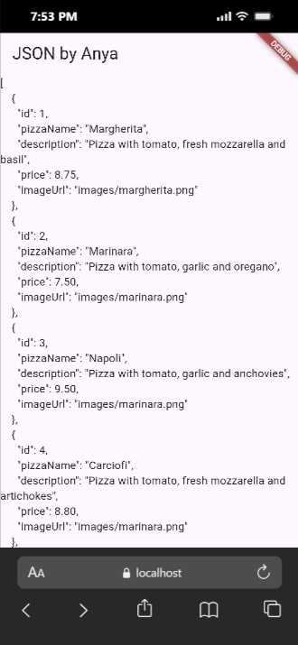
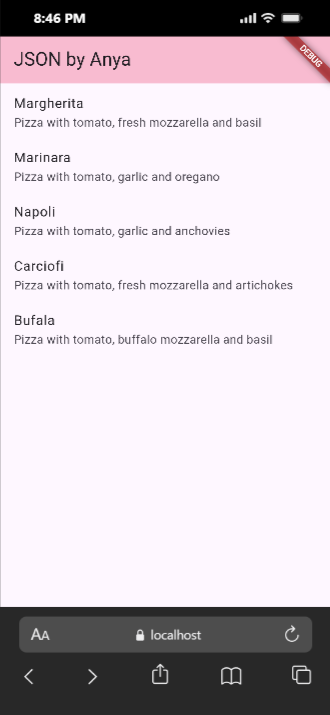
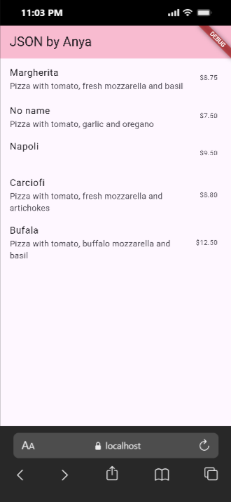
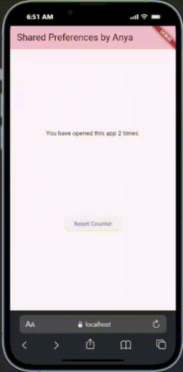
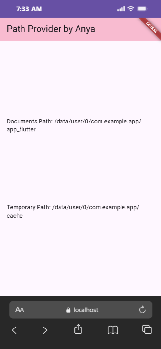
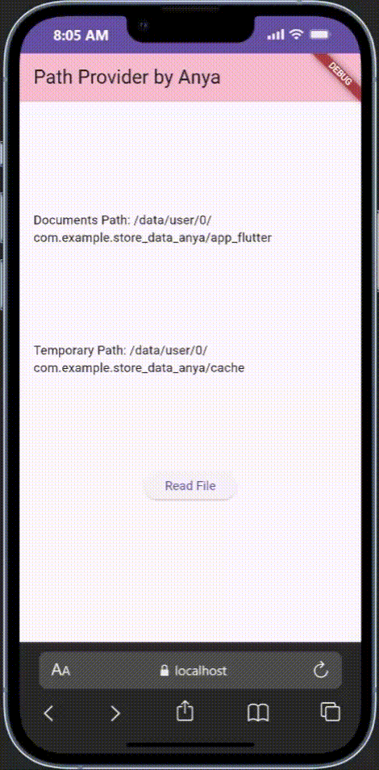

Nama : Anya Callissta Chriswantari
 NIM : 2341720234
 Kelas : TI 3G
 Absen : 05

---

# PEMROGRAMAN MOBILE - PERTEMUAN 13

## Praktikum 1 - Konversi Dart Model ke JSON
### Soal 1
Tambahkan nama panggilan Anda pada title app sebagai identitas hasil pekerjaan Anda. 

_Gambar 1. Ouput Praktikum 1 Soal 1_

### Soal 2

_Gambar 2. Ouput Praktikum 1 Soal 2_

### Soal 3

_Gambar 3. Ouput Praktikum 1 Soal 3_

## Praktikum 2 - Handle Kompatibilitas Data JSON
### Soal 4

_Gambar 4. Ouput Praktikum 2 Soal 4_

## Praktikum 3 - Menangani Error JSON
### Soal 5

_Gambar 5. Ouput Praktikum 3 Soal 5_

Jelaskan maksud kode lebih safe dan maintainable!
>Jawab: Menggunakan konstanta untuk key JSON membuat kode lebih aman dan mudah dirawat karena dapat mencegah kesalahan penulisan yang sulit dideteksi saat menggunakan string literal langsung, sebab setiap kesalahan penulisan key akan langsung terdeteksi oleh compiler. Selain itu, perubahan nama key di backend menjadi jauh lebih mudah karena cukup mengubah satu nilai konstanta tanpa perlu mencari dan mengganti banyak string yang tersebar di berbagai file. Praktik ini juga menghindari penggunaan magic strings yang tidak terorganisir, sehingga kode menjadi lebih konsisten, bersih, dan mudah dikelola terutama pada proyek besar atau dikerjakan oleh banyak developer.

## Praktikum 4 - Shared Preferences
### Soal 6

_Gambar 6. Ouput Praktikum 4 Soal 6_

## Praktikum 5 - Akses File System dengan path_provider
### Soal 7

_Gambar 7. Ouput Praktikum 5 Soal 7_

## Praktikum 6 - Akses File System dengan Direktori
### Soal 8

_Gambar 8. Ouput Praktikum 6 Soal 8_

Jelaskan maksud kode pada langkah 3 dan 7!
>Jawab: Pada langkah 3 dibuat fungsi bertipe boolean untuk menulis teks ke dalam file, jika true akan mengembalikan teks yang berisi nama dan nim, jika false gagal menulis teks.  Pada langkah 7 dilakukan klik button "Read File" yang nantinya akan memanggil method readFile() untuk mengembalikan teks yang sudah dibuat di langlah 3.

## Praktikum 7 - Menyimpan Data dengan Enkripsi/Dekripsi
### Soal 9

_Gambar 9. Ouput Praktikum 7 Soal 9_