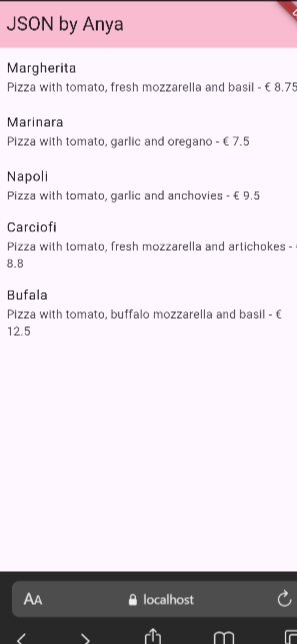
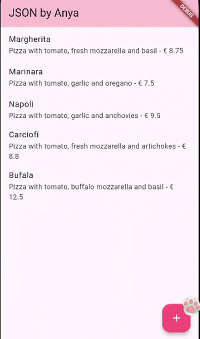
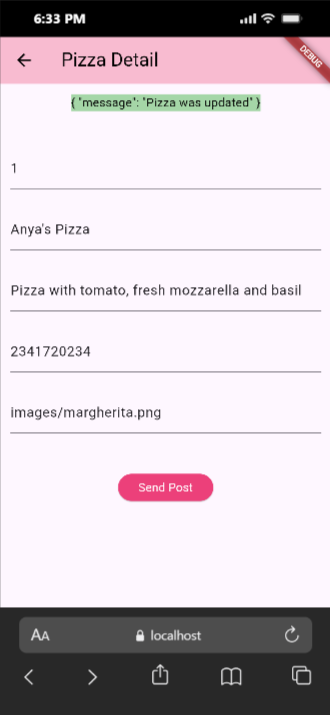
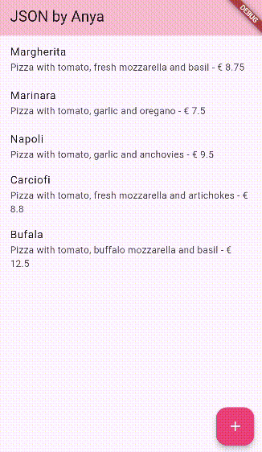

Nama : Anya Callissta Chriswantari
 NIM : 2341720234
 Kelas : TI 3G
 Absen : 05

---

# PEMROGRAMAN MOBILE - PERTEMUAN 14

## Praktikum 1 - Membuat layanan Mock API
### Soal 1
Tambahkan nama panggilan Anda pada title app sebagai identitas hasil pekerjaan Anda. 

_Gambar 1. Ouput Praktikum 1 Soal 1_

## Praktikum 2 - Mengirim Data ke Web Service (POST)
### Soal 2

_Gambar 2. Ouput Praktikum 2 Soal 2_

## Praktikum 3 - Memperbarui Data di Web Service (PUT)
### Soal 3

 

.png)

_Gambar 3. Ouput Praktikum 3 Soal 3_

## Praktikum 4 - Menghapus Data dari Web Service (DELETE)
### Soal 4

_Gambar 4. Ouput Praktikum 4 Soal 4_